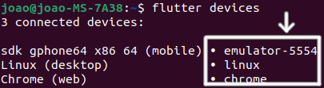

# Resta Um


## Código fonte
 - Baixe um executável para [Andoid ou Linux](https://github.com/jbrenorv/restaum/releases) ou continue lendo e gere seu próprio executável.

 - O código fonte do projeto encontra-se na pasta `lib/`

 - As imagens e sons estão na pasta `assets/`
 
 - O código dos sockets está na pasta `lib/socket/`

 - As bibliotecas de terceiros que foram utilizadas são listadas no arquivo `pubspec.yaml`, e a documentação de cada uma pode ser encontrada no site [pub.dev](https://pub.dev/)

## Flutter setup
 - Instale o Flutter [3.13.0](https://docs.flutter.dev/release/archive?tab=linux) do canal stable

 - Adicione o Flutter às suas variáveis de ambiente

 - Abra o terminal na pasta raiz do projeto e instale as dependências:
    ```bash
    flutter pub get
    ```

### Android
 - Baixe e instale o [Android Studio](https://developer.android.com/studio)

 - Aceite as licenças do android:
    ```bash
    flutter doctor --android-licenses
    ```

 - Gere um apk:
    ```bash
    flutter build apk
    ```

 - Ou execute em modo debug em um emulador ou no seu próprio dispositivo android por meio de um cabo usb, neste caso é necessário que o modo desenvolvedor e a depuração usb estejam ativos
    ```bash
    flutter run -d emulator-5554
    ```
 - Para descobrir os dispositivos disponíveis use o comando `flutter devices`:
    

### Linux
 - Instale as dependências do Flutter no Linux:
    ```bash
    sudo apt-get install clang cmake git ninja-build pkg-config libgtk-3-dev liblzma-dev libstdc++-12-dev
    ```

 - Faça uma build para Linux:
    ```bash
    flutter build linux
    ```

 - Ou execute o app em modo debug:
    ```bash
    flutter run -d linux
    ```

### Windows, macOS e IOS
 - Acesse a [documentação](https://docs.flutter.dev/get-started/install)

### Web
 - Este app é incompatível com a plataforma Web, pois utiliza a biblioteca `dart:io`.